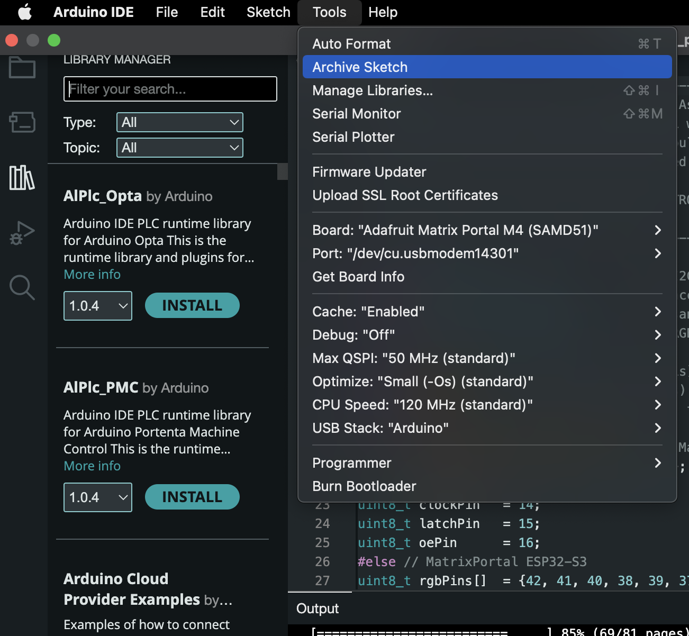
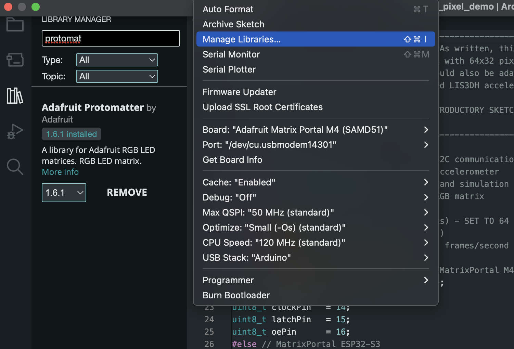
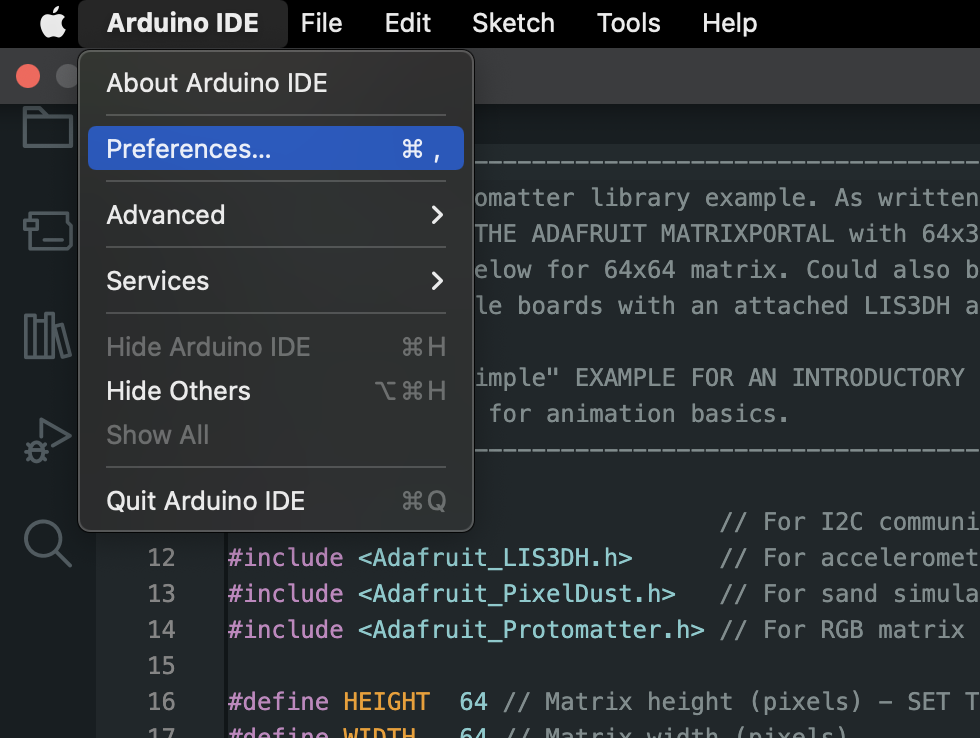
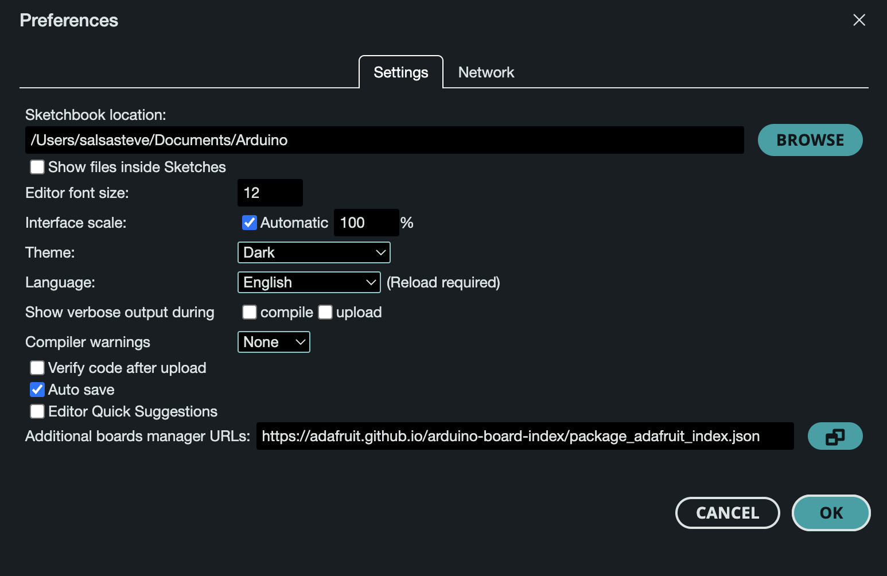
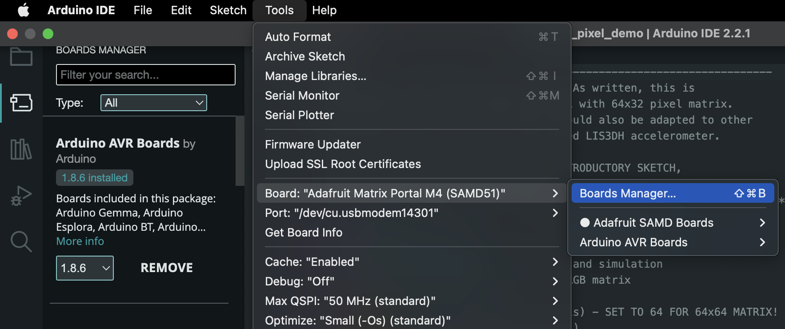

# Arduino Libraries and Unofficial Boards Installation Guide

## Table of Contents
1. [Introduction](#introduction)
2. [Installing Libraries in Arduino IDE](#installing-libraries-in-arduino-ide)
3. [Installing Unofficial Boards](#installing-unofficial-boards)

### Introduction

This README guide provides step-by-step instructions on how to install libraries in the Arduino Integrated Development Environment (IDE) and how to install unofficial boards(Matrix Portal M4). 

### Installing Libraries in Arduino IDE

#### Step 1: Open Arduino IDE
Open your Arduino IDE. 

#### Step 2: Accessing the Library Manager
Navigate to `Tools > Manage Libraries...`

#### Step 3: Searching and Installing Libraries
In the Library Manager, search for the library you need and click on `Install`.
For the dust_pixel_demo you need the `protomatter` and the `Adafruit GFX Library`

### Installing Unofficial Boards

#### Step 1: Open Arduino IDE Preferences
Open `Arduino IDE > Preferences` (on Mac)

#### Step 2: Adding Board Manager URLs
In the Additional Boards Manager URLs field, enter the URL for the unofficial board.

#### Step 3: Installing the Board
Open `Tools > Board: "board name" > Boards Manager...`, search for the unofficial board, and click `Install`.
For the Matrix Portal M4 you need to add this url `https://adafruit.github.io/arduino-board-index/package_adafruit_index.json`

